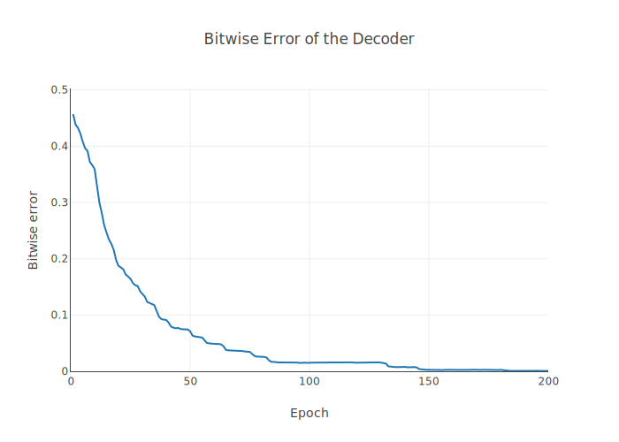
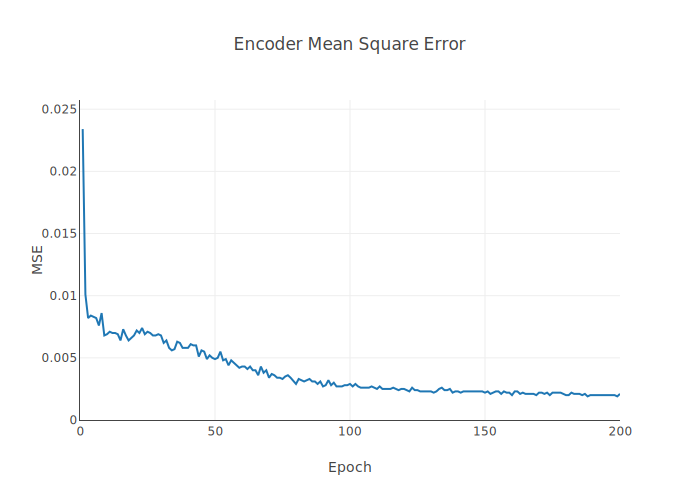
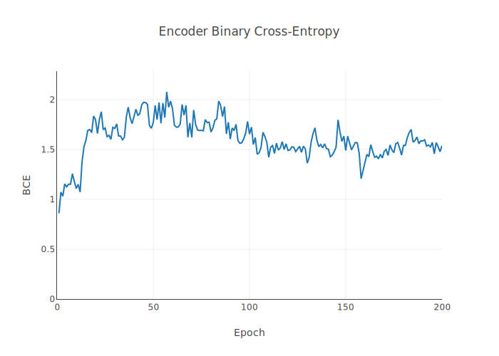
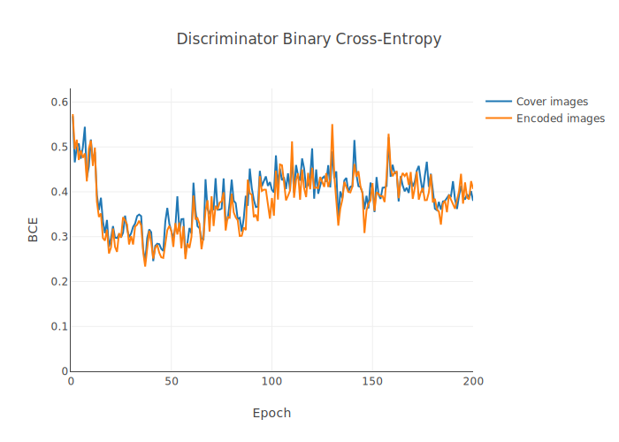

# Experiments 

## Experimental setup.
We try to follow the experimental setup of the original paper as closely as possibly.
We train the network on 10,000 random images from [COCO dataset](http://cocodataset.org/#home). We use 200-400 epochs for training and validation.
The validation is on 1,000 images. During training, we take randomly positioned center crops of the images. This makes sure that there is very low chance the network will see the exact same cropped image during training. For validation, we take center crops which are not random, therefore we can exactly compare metrics from one epoch to another. 

Due to random cropping, we observed no overfitting, and our train and validation metrics (mean square error, binary cross-entropy) were extremely close. For this reason, we only show the validation metrics here. 

When measuring the decoder accuracy, we do not use error-correcting codes like in the paper. We take the decoder output, clip it to range [0, 1], then round it up. 

## Default settings, no noise layers

This experiment is with default settings from the paper, and no noise layers. 

### Decoder Accuracy 

This shows the accuracy of the decoder in recovering encoded bits. The decoder is training properly, and is ably to recover ~100% of the encoded bits.

### Watermarked Image Quality

### Adversarial training

